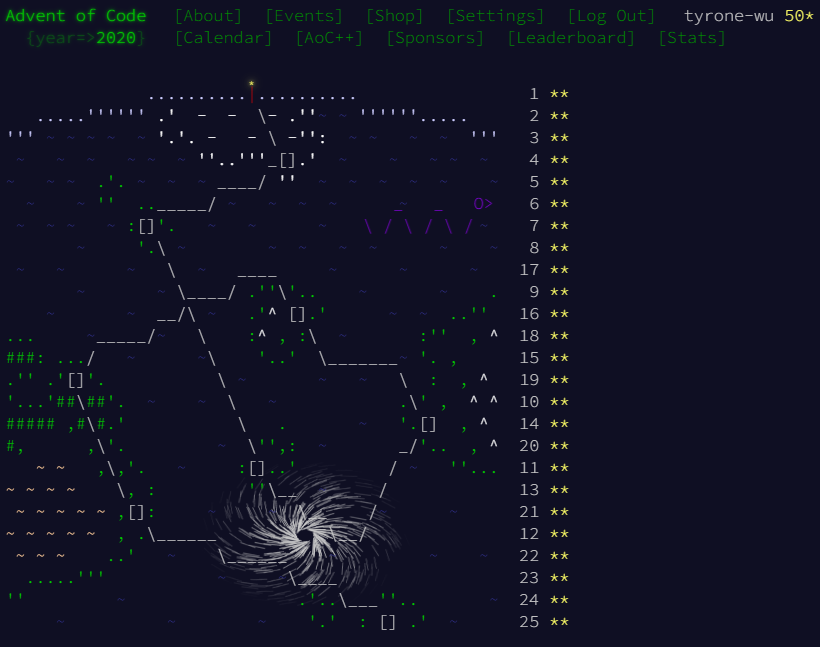

# 🎄 Advent of Code 2020



# Advent Of Code Zig Template

This repo provides a template for Advent of Code participants using Zig.  It contains a main file for each day, a build.zig file set up with targets for each day, and Visual Studio Code files for debugging.

This template has been tested with Zig `0.13.0` and `0.14.0-dev.2198+e5f5229fd`.  It may not work with other versions.

## How to use this template:

The src/ directory contains a main file for each day.  Put your code there.  By default this template does not link libc, but you can set `should_link_libc` to `true` in build.zig to change that.

The build command `zig build dayXX [target and mode options] -- [program args]` will build and run the specified day.

You can also use `zig build install_dayXX [target and mode options]` to build the executable for a day and put it into `zig-out/bin` without executing it.

If you add new files with tests, add those files to the list of test files in `test_all.zig`.  The command `zig build test` will run tests in all of these files.

You can also use `zig build test_dayXX` to run tests in a specific day, or `zig build install_tests_dayXX` to create a debuggable test executable in `zig-out/bin`.

```zig
# build and run specified day
$ zig build dayXX [target and mode options] -- [program args]

# build executable for specific day into `zig-out/bin`
$ zig build install_dayXX [target and mode options]

# run all tests
$ zig build test

# run test for specified day
$ zig build test_dayXX

# build executable for specified test day
$ zig build install_tests_dayXX
```

Each day contains a decl like this:
```zig
const data = @embedFile("data/day05.txt");
```
To use this system, save your input for a day in the src/data/ directory with the appropriate name.  Reference this decl to load the contents of that file as a compile time constant.  If a day has no input, or you prefer not to embed it in this form, simply don't reference this decl.  If `data` is unused, the compiler will not try to load the file, and it won't error if the file does not exist.

This repo also contains Visual Studio Code project files for debugging.  These are meant to work with the C/C++ plugin.  There is a debug configuration for each day.  By default all days are built in debug mode, but this can be changed by editing `.vscode/tasks.json` if you have a need for speed.

If you would like to contribute project files for other development environments, please send a PR.

## Modifying the template

You can modify the template to add your own changes across all days.  To do so, modify template/template.zig and then run `zig build generate`.  The `$` character in the template will be replaced by the two-digit day number (e.g. 04 or 17).  This step will only overwrite files which have not been modified, so you will not lose work if you update the template after implementing several days.  After updating the template and generating, you should commit the changes to template/hashes.bin in addition to the updated template and source files.  This will ensure that the newly generated files are not considered modified if you update the template again.

## Setting up ZLS

Zig has a reasonably robust language server, which can provide autocomplete for VSCode and many other editors.  It can help significantly with exploring the std lib and suggesting parameter completions.  The VSCode extension (augusterame.zls-vscode) will automatically install the language server in the background.  If you are using a different editor, follow their [install instructions](https://zigtools.github.io/install-zls/).  If you want to install a specific version of the language server (for example for maximum compatibility with 0.10.0), [check their releases page](https://github.com/zigtools/zls/releases) or [follow their instructions to build from source](https://github.com/zigtools/zls#from-source).  Note that ZLS tracks master, so if you are using Zig 0.10.0 you may need to download a newer version to build ZLS.
